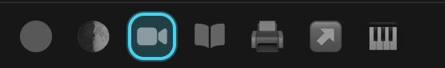

# Spaces Icons

Spaces Icons is a Zen Browser workspace-icon mod. It adds three settings for the
workspace switcher icons shown in the browser UI:

- a size preset
- a color-mode toggle for inactive spaces
- an active-space highlight color preset

## Preview

## What The Mod Changes

- only the workspace switcher icons are resized with a 100-250% size setting. Leave 100% for original size.
- only the active workspace gets the colored highlight box
- the workspace switcher reserves side space for enlarged icons so neighboring toolbar buttons do not overlap it
- the current-workspace label, tabs, and other toolbar icons are left alone

## Available Settings

### Space icon size

Choose one of these presets:

- 100%
- 125%
- 150%
- 200%
- 250%

### Active space highlight color

Choose one of these preset colors:

- Blue
- Sky
- Cyan
- Teal
- Mint
- Green
- Lime
- Yellow
- Amber
- Orange
- Coral
- Red
- Rose
- Pink
- Fuchsia
- Purple
- Violet
- Indigo
- Slate
- Silver
- White
- Black

### Inactive icon color mode

Choose whether colorful space icons stay colored when inactive:

- On: only the active space shows full icon color
- Off: colorful space icons stay colored even when inactive

## Usage Notes

- The color setting uses a dropdown so it works cleanly with Zen's documented
  mod preference UI.
- Larger size presets increase the icon size while keeping the highlight aligned.
- Larger size presets add side spacing around the workspace switcher to keep adjacent toolbar icons separate.
- The inactive icon color toggle defaults to active-only coloring.
- The default highlight color is Cyan.
